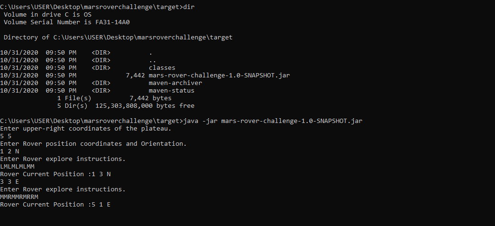

# THE-MARS-ROVER-CHALLENGE
The Mars rover challenge automated solution by Rajith Asanka using java as the main programming language.

## Development Methodology
#### Tools and Technology Stack.

JDK 1.8, Intellij , Maven – Development environment 
JAVA programming language  

## Application Demonstration
#### Build Commands for Application
##### marsroverchallenge - application source folder
##### mvn clean install - to build the application  use maven build commands.
## Run Commands

#####  java -jar mars-rover-challenge-1.0-SNAPSHOT - to run application.

###### Sample Demonstation Screen

